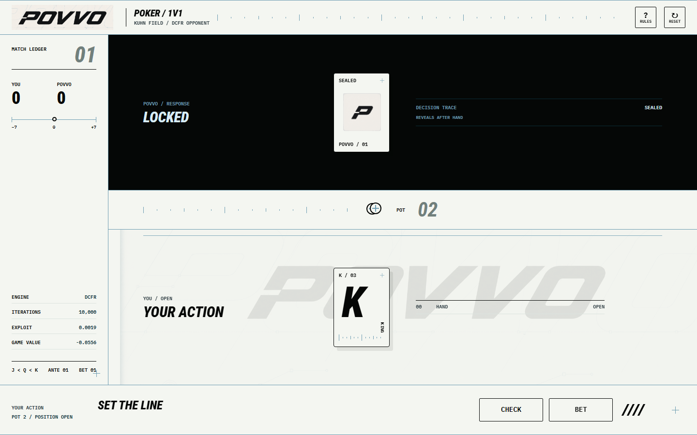
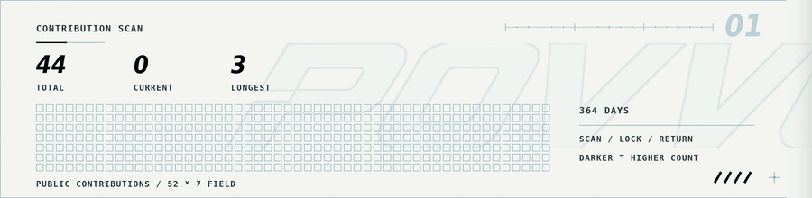
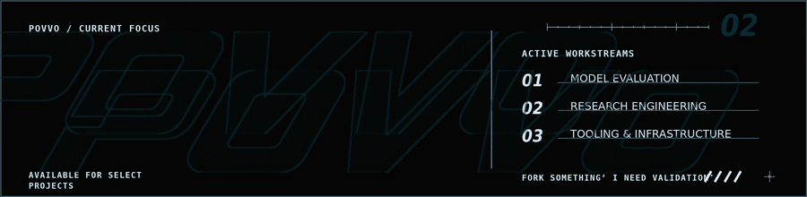
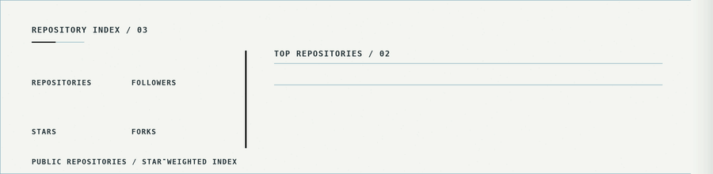
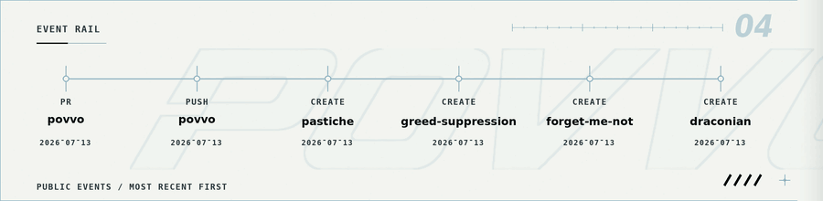
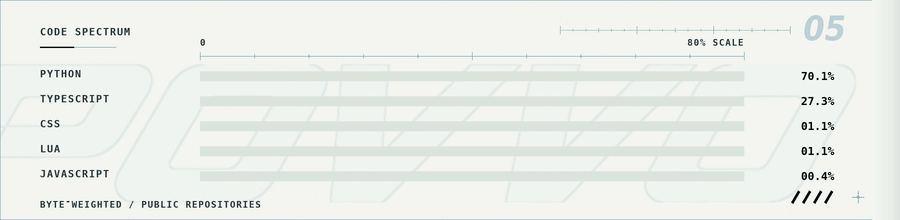
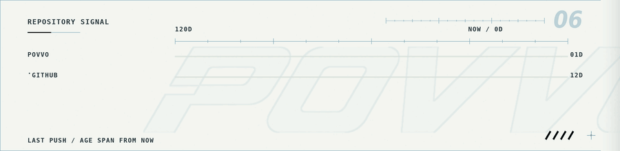

  

  

  <picture>
    <source media="(prefers-reduced-motion: reduce)" srcset="./widgets/generated/contribution-scan.svg">
    
  </picture>

  <picture>
    <source media="(prefers-reduced-motion: reduce)" srcset="./widgets/generated/focus-board.svg">
    
  </picture>

  <picture>
    <source media="(prefers-reduced-motion: reduce)" srcset="./widgets/generated/repository-index.svg">
    
  </picture>

  <picture>
    <source media="(prefers-reduced-motion: reduce)" srcset="./widgets/generated/event-rail.svg">
    
  </picture>

  <picture>
    <source media="(prefers-reduced-motion: reduce)" srcset="./widgets/generated/code-spectrum.svg">
    
  </picture>

  <picture>
    <source media="(prefers-reduced-motion: reduce)" srcset="./widgets/generated/repository-signal.svg">
    
  </picture>

