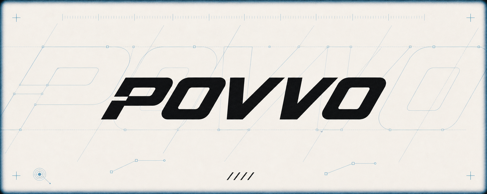
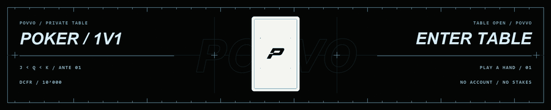
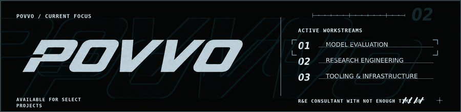

  

  <a href="https://povvo.github.io/povvo/">
    <picture>
      <source media="(prefers-reduced-motion: reduce)" srcset="./archive/poker/profile-strip.png">
      
    </picture>
  </a>

  <a href="./assets/widgets/">
    <picture>
      <source media="(prefers-reduced-motion: reduce)" srcset="./assets/widgets/focus-board.svg">
      
    </picture>
  </a>

  <a href="https://github.com/povvo/motion-design-skills">
    <picture>
      <source media="(prefers-reduced-motion: reduce)" srcset="https://raw.githubusercontent.com/povvo/motion-design-skills/main/cookbook/pleat/media/pleat-poster-4k.png">
      
    </picture>
  </a>

