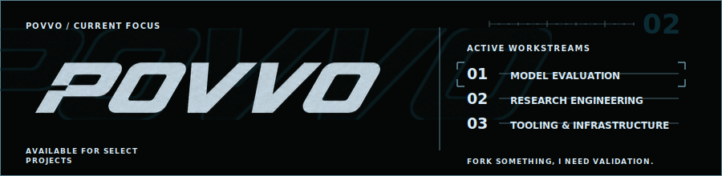
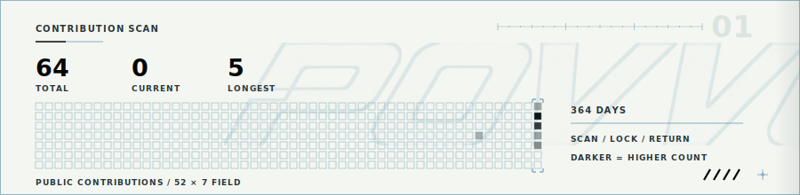
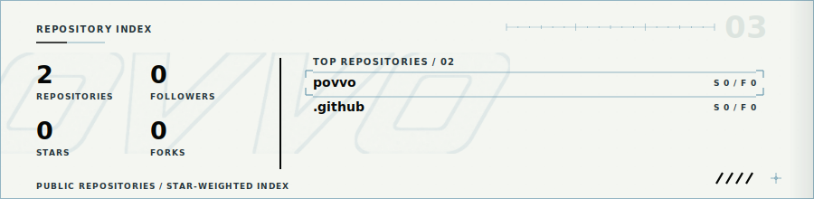
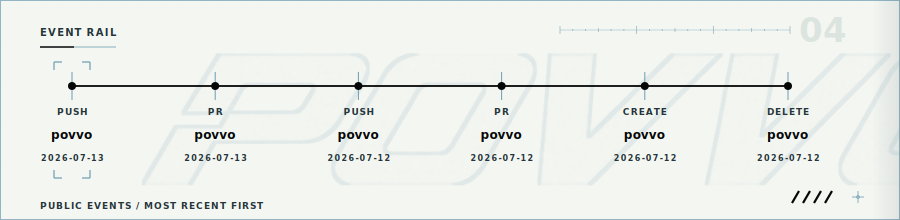
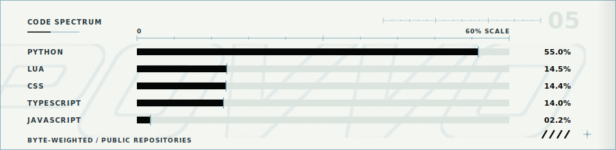
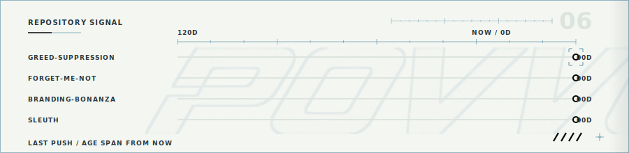

# Povvo Telemetry

Static, reduced-motion views from the live Povvo profile telemetry system. The profile reel is assembled from these six generated SVG sources.

## Current Focus

## Contribution Scan

## Repository Index

## Event Rail

## Code Spectrum

## Repository Signal

